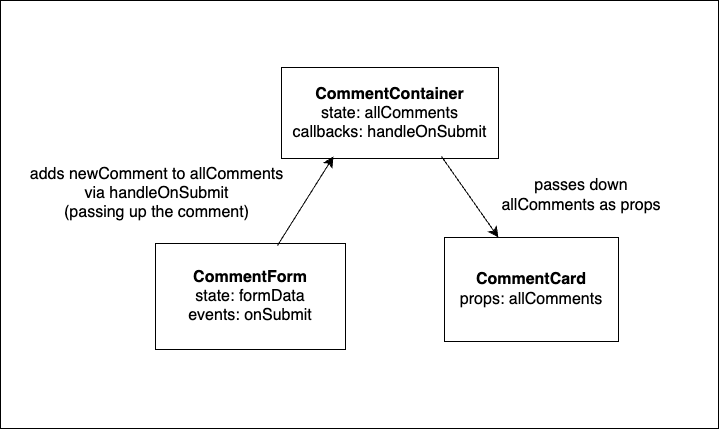

# React Forms

## SWBATs:

- [ ] Explain the difference between a controlled and uncontrolled input
- [ ] Explain why controlled inputs are preferred by the React community
- [ ] Review how to use callback functions with events in React
- [ ] Review how to change parent state from a child component

---

## What is a controlled input 

In React, rather than looking into the DOM to get the form's input field values when the form is submitted, we use state to monitor the user's input as they type, so that our component state is always in sync with the DOM.

This allows us to pass these values to other components and event handlers.


---

## Making an input controlled 

To keep track of each input's value, you need:

1. State for the input that will manage the input's value

2. An `onChange` listener attached to the input to monitor users behavior and update state as the user interacts with the field

3. A `value` attribute on the input that corresponds to that piece of state

Form components also need an `onSubmit` listener on the form element to handle the submitted form data.

---

## Examples

Uncontrolled:
```js
function CommentForm() {
  const [username, setUsername] = useState("");
  const [comment, setComment] = useState("");

  return (
    <form>
      <input type="text" name="username" />
      <textarea name="comment" />
      <button type="submit">Submit</button>
    </form>
  );
}
```

Controlled:
```js
function CommentForm() {
  const [username, setUsername] = useState("");
  const [comment, setComment] = useState("");

  function handleUsernameChange(event) {
    setUsername(event.target.value);
  }

  function handleCommentChange(event) {
    setComment(event.target.value);
  }

  return (
    <form>
      <input type="text" name="username" onChange={handleUsernameChange} />
      <textarea name="comment" onChange={handleCommentChange} />
      <button type="submit">Submit</button>
    </form>
  );
}
```

---

## 🛠️ ProjectForm setup 

1. For each input element in the form, create a new state variable:

```js
const [name, setName] = useState("");
const [about, setAbout] = useState("");
const [phase, setPhase] = useState("");
const [link, setLink] = useState("");
const [image, setImage] = useState("");
```

A more elegant approach is to create a state object with key/value pairs associated with each form field:

```js
const [formData, setFormData] = useState({
  name: "",
  about: "",
  phase: "",
  link: "",
  image: "",
});
```

Note: The above works well for a form that has multiple string/number/textarea/select inputs but gets a bit clunkier when the form includes inputs like checkboxes or files. [React docs](https://reactwithhooks.netlify.app/docs/forms.html) recommend an external library like [Formik](https://formik.org/) as a complete solution for forms.

---

2. Connect the `value` attribute of each input field to the corresponding state variable:

Example:

```js
<input
  type="text"
  id="name"
  value={formData.name}
/>
```

❗Note: The reason `formData.name` is being used is because the state variable is an object named `formData`. To access the value of a key within the object, dot notation is used.

---

3. Add an onChange listener for each input field using a helper function:

Example:

```js
<input type="text" id="about" onChange={handleOnChange} />
```

🤯 If using individual pieces of state for form fields, a separate helper function will be created for each corresponding field.

Example:

```js
<input type="text" id="about" onChange={handleAboutChange} />
```

```js
<input type="text" id="phase" onChange={handlePhaseChange} />
```

---

4. Adding a `name` attribute to the input fields:

```js
<input
  type="text"
  id="link"
  onChange={handleOnChange}
  value={formData.link}
  name="link"
/>
```

❗ IMPORTANT:  The `name` attribute needs to match with the key created in the state object in order to update the value. If the key in the state object is 'link' then the `name` attribute for the corresponding input field should be `link` as well

---

5. Updating the state when the onChange occurs (aka when the user begins typing or changing parts of the form):

```js
const handleOnChange = (e) => {
  // e.target will return an object, the element that triggered the event with properties
  // including name and value. Object destructuring is used to extract that values from e.target

  // This is the same as doing:
  // const name = e.target.name
  // const value = e.target.value

  const { name, value } = e.target;

  // The setter function is then invoked and a new object will  be created with the 
  // contents of the previous formData spread and the new key/value added to avoid overwriting the 
  // previous form field values

  setFormData((formData) => ({ ...formData, [name]: value }));
};
```

---

6. On the `<form>` element, add an `onSubmit` listener with a `handleSubmit` helper function that will run when the form is submitted:

```js
<form className="form" autoComplete="off" onSubmit={handleSubmit}></form>
```

```js
const handleSubmit = (e) => {
  e.preventDefault();
};
```

---

## Inverse Data Flow and Form Submission

When the form actually submits, it's helpful to pass the new data from the form up to a parent component. Imagine we have an app like this:



When the user submits out the comment form, a new CommentCard should be rendered. The CommentContainer holds an array of comments in state, so it needs to be updated when a new comment is added. To achieve this, we need to pass down a callback function from the CommentContainer to the CommentForm as a prop

---

## 🔑 After the form has been submitted 

The state of `projects` is defined inside of the parent component `App` and the behavior occurs in the child component `ProjectForm`. When the new project is submitted, `projects` will need to be updated to include it.

---

Here is where the process of inverse data flow will need to occur:

1. Create a helper function in `App` component called `onAddProject` that will update the `projects` state:

```js
const onAddProject = (newProject) => {
  setProjects([...projects, newProject]);
};
```

`projects` is an array so to update the state, a new array will be created with the elements of the original `projects` array spread and the new project passed to `onAddProject` added as a new element

Pass `onAddProject` as a prop to `ProjectFrom` from within `App` component:

```js
<ProjectForm onAddProject={onAddProject} />
```

---

Inside the `ProjectForm` component, destructure `onAddProject` from the props and invoke it from within the `handleSubmit` function, passing it the formData object:

```js
const handleSubmit = (e) => {
  e.preventDefault();
  onAddProject(formData);

  // after we have delivered the formData to the App component and updated state
  // clear the form by setting the values back to empty strings:

  setFormData({
    name: "",
    about: "",
    phase: "",
    link: "",
    image: "",
  });
};
```

---

## 💡 Conclusion 

- State is a very integral part of the way that React applications render and manipulate the DOM. 
- React prefers using state to update the forms and keep track of the form fields values, making them controlled inputs, rather than letting form inputs manage their own internal state (through their value). 
- What our user sees in the input fields reflects the value of the state associated with that field. 
- Example: Doing this allows us to make an edit form populated with a project's previously saved values for the inputs by setting the formState to match the saved record.

---

## 🤗 Reconciliation 🤗

- When setState is called, React will re-render that component and all of its children
- This is an expensive operation, so React optimizes by running a diffing algorithm to decide which components actually need to trigger committed changes to the DOM.
- This diffing process is called [reconciliation](https://reactwithhooks.netlify.app/docs/reconciliation.html)
- During reconciliation, React compares its own picture of the current state of the DOM tree with what it should look like after the change. Using this diff, the minimal DOM manipulation necessary is committed to reconcile the current DOM tree with what it should be after the change to state.

---

## Why we don't mutate state directly

- One of the choices made in the reconciliation process is to only commit to updating a component in the DOM if one of its nodes or property values has changed. If all nodes (types of React elements) and their props and values are the same, React will leave that component unchanged from the previous render.

If an object or array is mutated directly and then set as the new value for state **React sees the same object in state as the previous render and leaves the DOM untouched**

```js
// so don't do this because it won't update the DOM
state.prop = "New Value"
setState(state);

// do this instead because it will (newState object will be different from the old one)
setState(state => ({...state, prop: "New Value"}))
```
