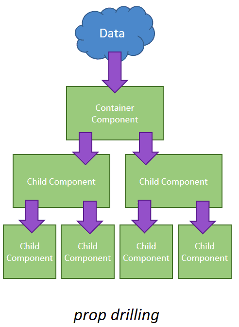
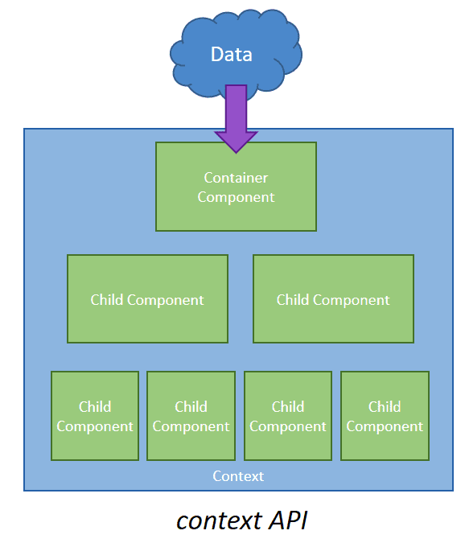

---

title: "08_context"

---

# React Context

---

## ✅ Objectives 

---

## 🔩 Prop Drilling

- Occassionally you may find yourself passing props deeply down the component tree across many components 

This can get very complicated, tedious, and messy...



---

## Context

That's why we have React Context!

- React Context provides a way to share data across components without manually passing props to each component
- This is useful for passing down user preferences or authentication status, location-specific data, dark theme or light theme



---

## How to use context?

1. create the context
2. wrap your component tree with the context provider
3. pass any values into your context provider
4. read the value in whatever component you want using the context consumer

---

## A few notes

- context doesn't hold info, it represents the KIND of info you can provide


## createContext()

- To create a context we use createContext()!
- This method returns a Provider and Consumer component

```js
const UserContext = React.createContext(defaultValue)
```

Note: it is typical to create a separate file containing your contexts

---

## The Provider

- The provider is a React component that allows child components to use our context 
- We pass in a value prop which can be anything - a string, object, function, etc.

```js
//NOTE: YOU HAVE TO USE THE TERM 'VALUE'
<UserContext.Provider value={null}>
    <App /> 
</ UserContext.Provider>
```

- When the Provider's values change, all the Provider's descendants will re-render
- All we really do with the Provider is define what the Provider is capable of and wrap the appropriate components with it.

---

## The Consumer

- We call a descendant of the Provider 'The Consumer' when it wants to consume/use the data of the Provider
We could wrap our component in the  <Consumer /> component especialy if we want to support React < 16.8.0:

```js
<UserContext.Consumer>
    {context => {
        ...
    }}
</ UserContext.Consumer>
```

However we will be using the useContext() hook as it is cleaner 

---

## The useContext() hook

...


---

## Warning

- don't use context right away, see if you can better organize your components to avoid prop drilling (component composition)
- context is very useful when you're dealing with users

- be careful about updating values that get passed down with context
- this is because all the components that use that value will re-render
- if we use a value in a lot of components this can cause performance issues
