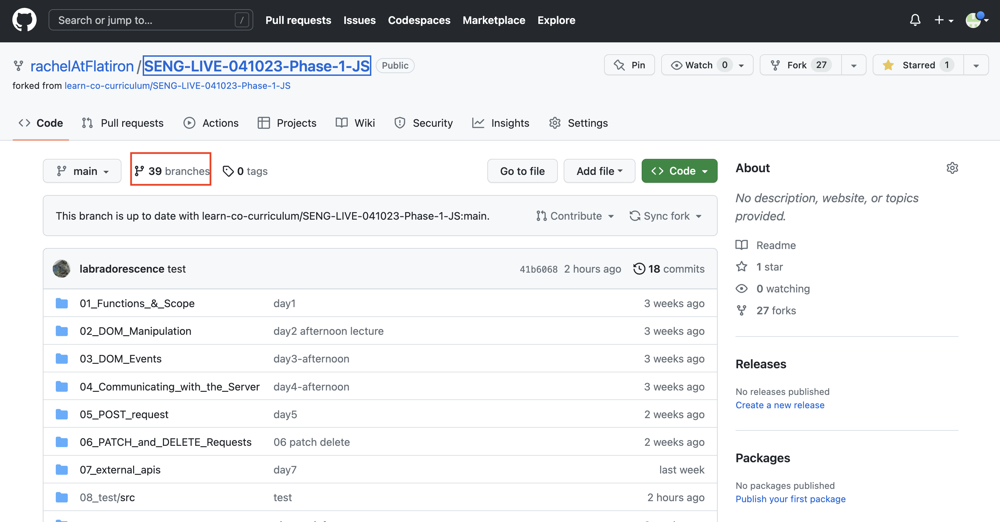
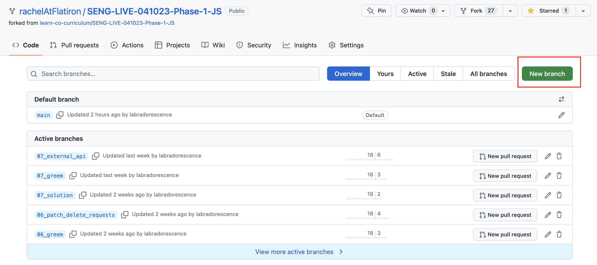
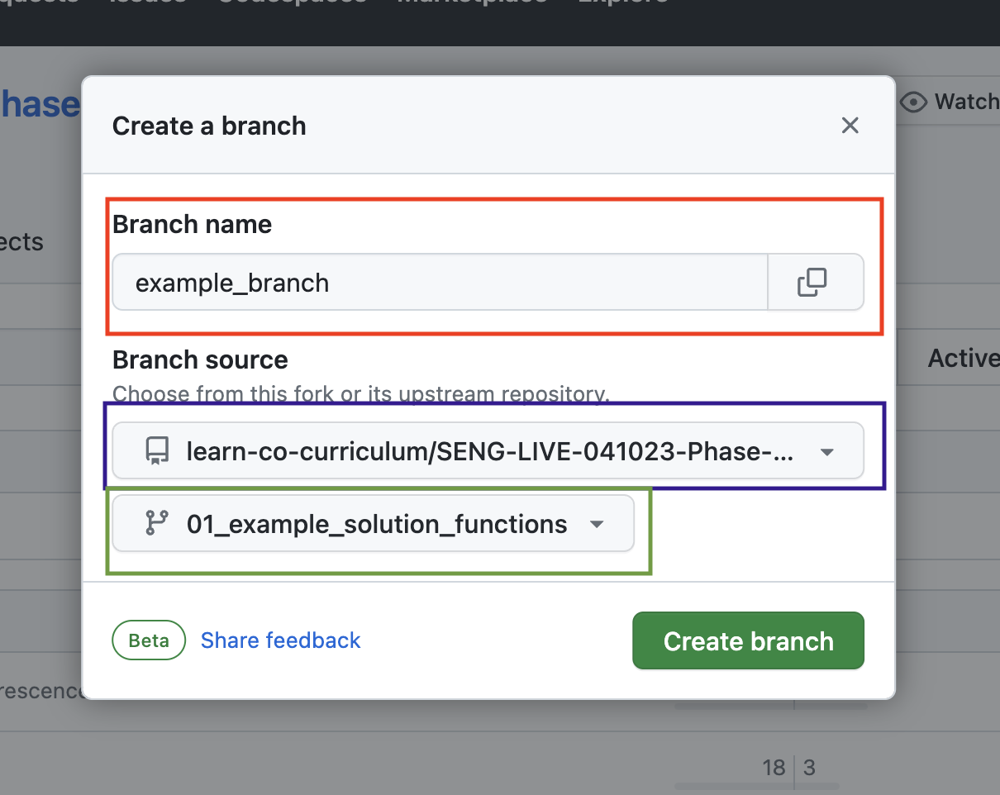

# Git Instructions

To get starter code...

### 1. Navigate to your phase repo in your github account
### 2. Navigate to all your branches
 

### 3. Click on 'new branch'

 

### 4. Fill out the form

 

- red: your branch name
- blue: my repo (rachelAtFlatiron/EAST...)
- green: the branch from my repo that you want

EX.

- red: my_02_starter
- blue: rachelAtFlatiron/EAST-SE-041023-Phase-2-React
- green: 02_starter

 

### 5. In terminal navigate to the appropriate folder

### 6. Run `git fetch` to get all new branches

### 7. Run `git checkout <branch-name>` to switch to the new branch

Ex. 
 

> `git fetch`
 

> `git checkout my_02_starter`

