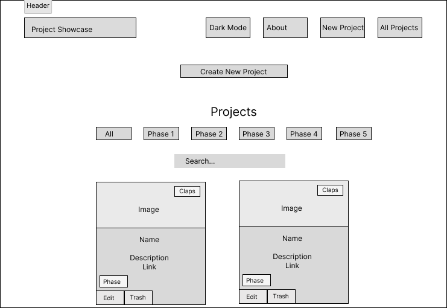
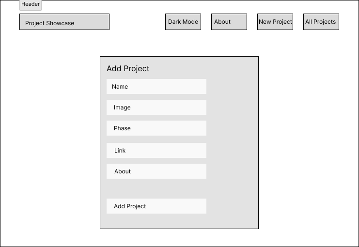
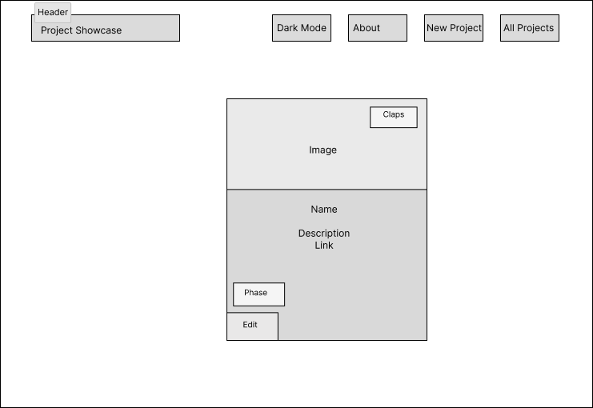
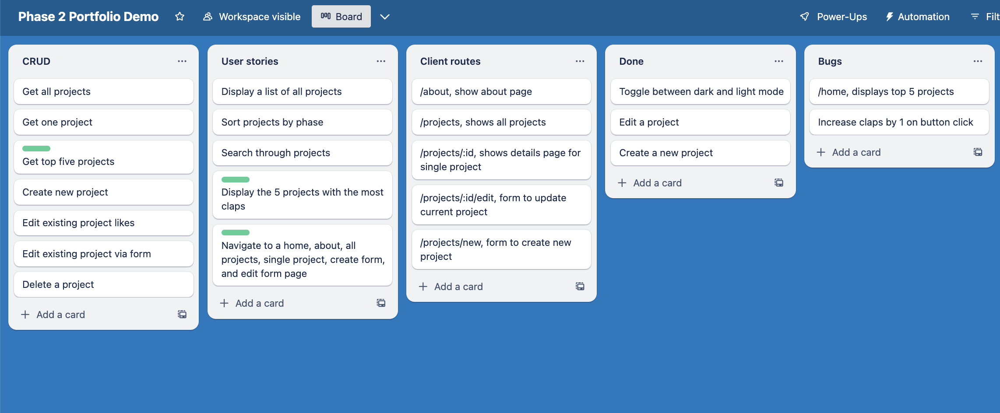

# Phase 2 Lecture Project Pitch Example

## [Wireframes](https://www.figma.com/file/EiEpomnCYh7AGbhqc2p3pk/Phase-2-Portfolio-Demo?type=design&node-id=0%3A1&t=YvzclA1k0MT8cjhW-1)

---

## User Stories
- User will be able to...
1. View all projects
2. View single project 
3. Like a project
4. Delete a project
5. Edit a project
6. Create a project
7. View top 5 most liked projects
8. View projects by phase
9. Toggle between dark and light mode

---

## React Tree

---

## [API Routes](https://documenter.getpostman.com/view/26331028/2s93Y3uLLX)
- [table markdown generating tool](https://www.tablesgenerator.com/markdown_tables)

| API Route     | Request Method | Body                                     | Response                                     |
|---------------|----------------|------------------------------------------|----------------------------------------------|
| /projects     | GET            |                                          | [{...}, {...}, ...]                          |
| /projects     | POST           | {name, about, phase, link, image, claps} | {id, name, about, phase, link, image, claps} |
| /projects/:id | DELETE         |                                          | {}                                           |
| /projects/:id | PATCH          | {name, ...}                              | {id, name, about, phase, link, image, claps} |
|/projects?_sort=claps&_order=desc&_limit=5|GET | | [top five projects] |

---

## Client Side Routes
| Client Route       | Component             |
|--------------------|-----------------------|
| /                  | Home.js             |
| /projects          | ProjectsPage.js     |
| /new               | CreateProjectForm.js|
| /about             | About.js            |
| /home              | Home.js             |
| /projects/:id      | ProjectDetails.js   |
| /projects/:id/edit | EditProjectForm.js  |

---

## Trello

